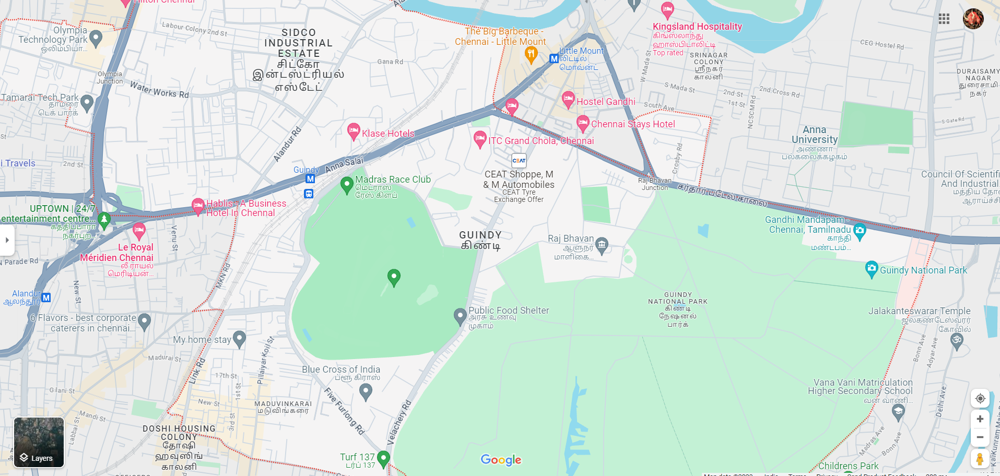

# EX-06: Places Around Me
# Aim:
To develop a website to display details about the places around my house.

# Design Steps:
## Step 1
Create a django admin interface.

## Step 2
Download your city map from google.

## Step 3
Using ```<map>``` tag name the map.

## Step 4
Create clickable regions in the image using ```<area>``` tag.

## Step 5
Write HTML program for all the regions identified.

## Step 6
Execute the programs and publish them
# Code:
```
map.html

<html>
    <head>
        <title>My City</title>
    </head>
    <body>
        <h1 align="center">
            <font color="red"><b>Guindy</b></font>
        </h1>
        <h3 align="center">
            <font color="blue"><b>Mathesh s (23013902)</b></font>
        </h3>
        
<map name="image_map">
  
  <area alt="madras race club" title="madras race club" href="club.html" coords="721,519,200" shape="circle">
  <area alt="ITC grand chola hotel" title="ITC grand chola hotel" href="hotel.html" coords="919,270,26" shape="circle">
  <area alt="klase hotel" title="klase hotel" href="hotel2.html" coords="677,256,27" shape="circle">
  <area alt="Blue cross of india" title="Blue cross of india" href="bluecross.html" coords="700,751,24" shape="circle">  
  <area alt="automobiles" title="automobiles" href="mobile.html" coords="991,315,28" shape="circle">


</map>

    </body>
</html>

club.html

<!DOCTYPE html>
<html lang="en">
<head>

</head>
<body style="background-color: darkseagreen;" align="center">
    <h1 style="font-family:Verdana, Geneva, Tahoma, sans-serif">MADRAS RACE CLUB</h1>
    <hr color="blue">
    <p style="color: aquamarine;">The Madras Race Club was officially constituted in 1837. The club functioned till 1875, when the Prince of Wales Edward VII visited Madras. Racing again went through a tough phase owing to financial reasons. Finally, in 1887, the club was revived. A balance of 11 rupees, 13 annas and 12 paise was carried forward to a new club called Madras Race Club with 50 members in January 1896. In 1887, a public meeting was called by Lt. Col. G. M. Moore, one of the stewards and it was presided over by the governor. New stewards were appointed at this meeting to run the club. The funds managed by the stewards of the Madras races were handed over to the club. The Trades Cup formed part of the racing programme proving that the traders patronised racing.
Racing continued in the 1900s although on a low key. It was brought to a temporary halt by World War I till Lord Willingdon, the then governor of Madras, revived it in 1919. In 1920, a stand was constructed with funds provided by two patrons, Maharaja of Bobbili and Maharaja of Venkatagiri. In 1931, the Guindy Lodge was built in the club premises for the secretary, and in 1933, the weighing room was constructed. Till 1952–1953, the Madras Race Club was under the Calcutta Turf Club after which it came, like all race courses in the south, under the South India Turf Club. Classic races were introduced in 1958–1959. In 1966, the Madras Race Club became an independent turf authority. Soon, as each one gained a separate status, the South India Turf Club became redundant.[1]</p>

    
</body>
</html>


hotel.html

<!DOCTYPE html>
<html lang="en">
<head>
</head>
<body style="background-color: blueviolet;" align="center">
    <h1 style="font-family: Verdana, Geneva, Tahoma, sans-serif;">ITC CHOLA HOTEL</h1>
    <hr color="green">
    <p style="color: azure;">The ITC Grand Chola is a 5-star luxury hotel in Chennai, India.[4] It is located in Guindy, opposite SPIC building and along the same row of buildings as Ashok Leyland Towers. The building, designed by Singapore-based SRSS Architects, is of mixed-use development with three separate wings and is themed after traditional Dravidian architecture of the Chola dynasty.[5] The hotel is the ninth hotel in The Luxury Collection brand.[6]
The hotel, built on over 1,600,000 sq ft, is dubbed the largest stand-alone hotel in the country[7] built with an investment of ₹ 12,000 million and has the largest convention centre in the country built on 100,000 sq ft with a 30,000-sq ft pillar-less ballroom.[8] In terms of room inventory, it is the third largest hotel in India with 600 rooms after Renaissance Mumbai Convention Centre Hotel – now rebranded as The Westin Mumbai Powai Lake (759 rooms) and Grand Hyatt (694 rooms), both in Mumbai.[9]</p>
    
</body>
</html>

bluecross.html

<!DOCTYPE html>
<html lang="en">
<head>
</head>
<body style="background-color:blanchedalmond;" align="center">
    <h1 style="font-family: Verdana, Geneva, Tahoma, sans-serif;">BLUE CROSS OF INDIA</h1>
    <p style="font-family: Verdana, Geneva, Tahoma, sans-serif;">The Blue Cross of India (BCI) is an animal welfare charity based in Chennai, India. It was established in 1959 by Captain V. Sundaram, his wife Usha and their three children, in Chennai (then Madras). The society was formally registered in 1964 under the Societies Registration Act. The nine signatories to the Articles and Memorandum of Association were Captain V. Sundaram, Usha Sundaram, S. Chinny Krishna, Suresh Sundaram, S. Vijayalakshmi, D. Daivasigamony, Kamakshi Krishnamoorthi, Sundari Nataraj and T. V. Chandrasekhar. It is now one of the country's largest animal welfare organisations. It runs several animal welfare programs including animal rights awareness.
The non-medical division of the organisation is looked after by volunteers. The organisation has received several national and international awards.
On July 27, 1994, thirty years after the organisation's founding, it received a gift of 4 acres (16,000 m2) of land and a donation of ₹ 25,00,000. This land was purchased a few months later so that they could have a permanent shelter.</p>

</body>
</html>

hotel2.html

<!DOCTYPE html>
<html lang="en">
<head>
    
</head>
<body style="background-color: blue;" align="center">
    <h1 style="font-family: Verdana, Geneva, Tahoma, sans-serif;">KLASE HOTEL</h1>
    <hr>
    <p style="color: black;">This Airport hotel located in the heart of the city and 10 minutes drive from chennai International Airport, also it is walkable distance from Guindy Industrial Estate.
This upscale hotel offers free wifi internet connectivity with banquet hall and board room facilities making it an suitable place for business travellers.
Our hotel is strategically placed in such a way that many tourist places like Snake park, Besant Nagar beach, Birla Planetarium, St Thomas mount, Guindy national park, and Phoneix Market city are nearby the Hotel.</p>
    
</body>
</html>

mobile.html

<!DOCTYPE html>
<html lang="en">
<head>
    
</head>
<body style="background-color: brown;" align="center">
    <h1 style="font-family: Verdana, Geneva, Tahoma, sans-serif;">CEAT M&M AUTOMOBILES</h1>
    <hr color="black">
   <p style="color:azure;"> Mumbai head-quartered CEAT, the flagship company of the Rs 22,000-crore RPG Enterprises, was established in 1958. Today, CEAT is one of India’s leading tyre manufacturers and has strong presence in global markets. CEAT produces over 15 million tyres a year and offers the widest range of tyres to all segments and manufactures world-class radials for: heavy-duty trucks and buses, light commercial vehicles, earthmovers, forklifts, tractors, trailers, cars, motorcycles and scooters as well as auto-rickshaws.
The address of this tyre shop is No 106, Shop No 5 to 8, Sudarshan Plaza, Velachery Road, Guindy, Chennai, Tamil Nadu.
   </p>
</body>
</html>

```


# Output:


# Result:
Thus the output executed successfully

